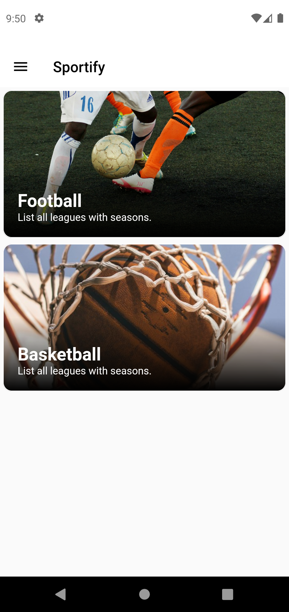
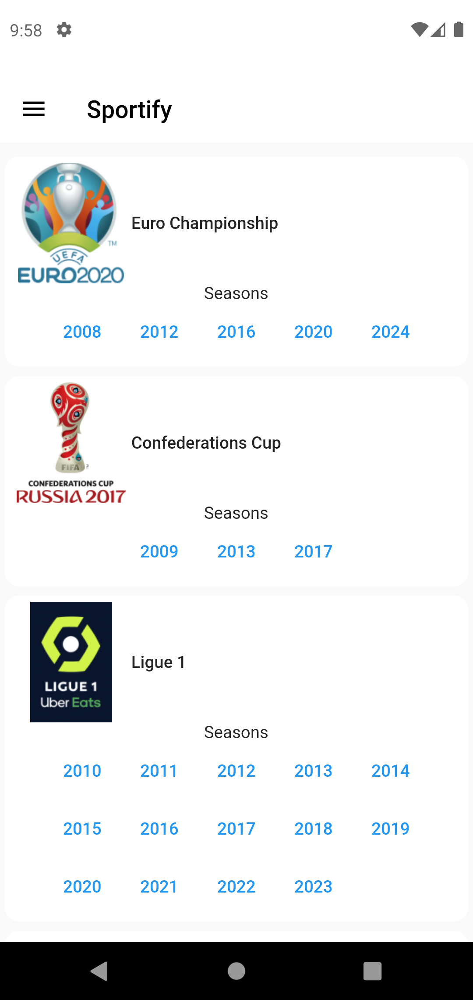
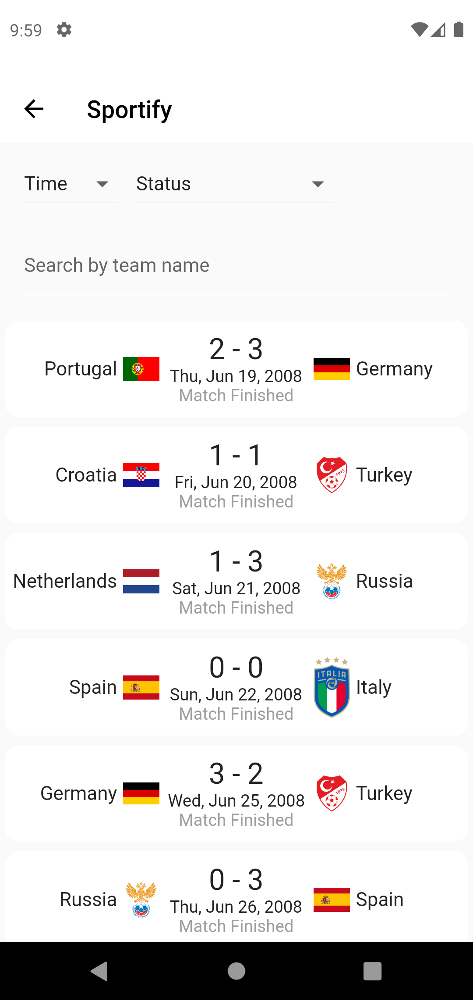
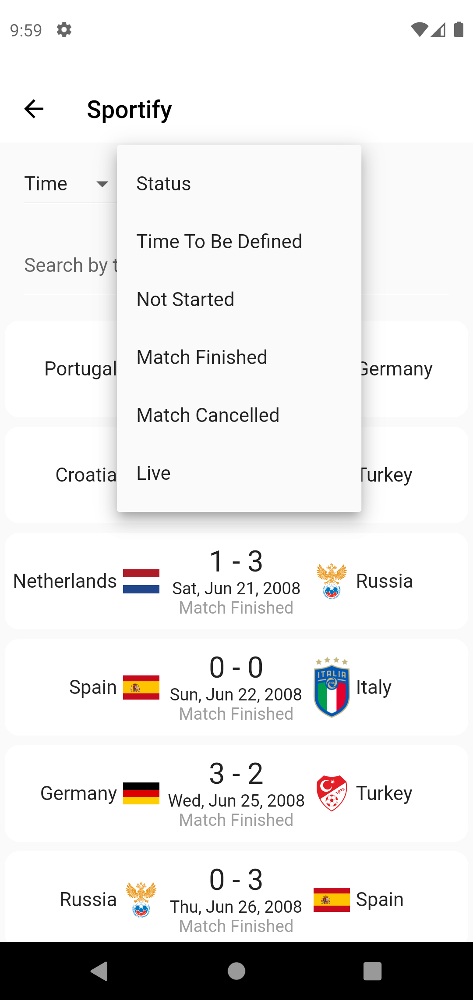
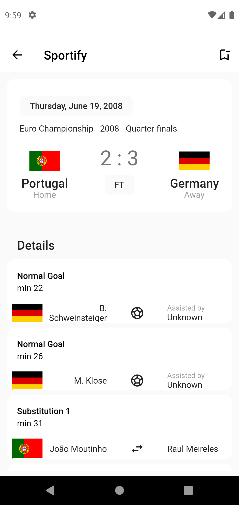

# Sportify

A mobile application for sports news and more made in Flutter.

# Getting started

This repository is the home of Sportify mobile application.
### Technologies
- [Freezed](https://pub.dev/packages/freezed) (Immutable models)
- [Riverpod + Hooks](https://pub.dev/packages/riverpod) (State management)
- [MVVM](https://en.wikipedia.org/wiki/Model%E2%80%93view%E2%80%93viewmodel) (Model-view-viewModel architecture)
- [Firebase](https://firebase.google.com/) (Database)

# How to use

## Step 0

This project is currently using Flutter 3.7.12.
```
https://docs.flutter.dev/release/archive
```

## Step 1

Download or clone this repository by using the link below:

```
https://github.com/antoniocranga/sportify.git
```

## Step 2

Go to project root and execute the following command in console to get the required dependencies:

```
flutter pub get 
```

## Step 3

This project uses inject library that works with code generation, execute the following command to generate files:

```
flutter packages pub run build_runner build --delete-conflicting-outputs
```

## Screenshots
## Screenshots
<p float="left">





</p>

# Wiki
Checkout [wiki] for more info (working on)
